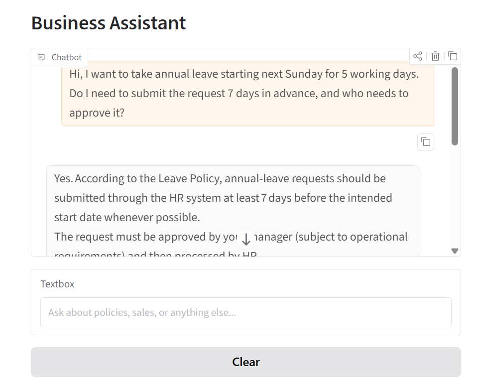
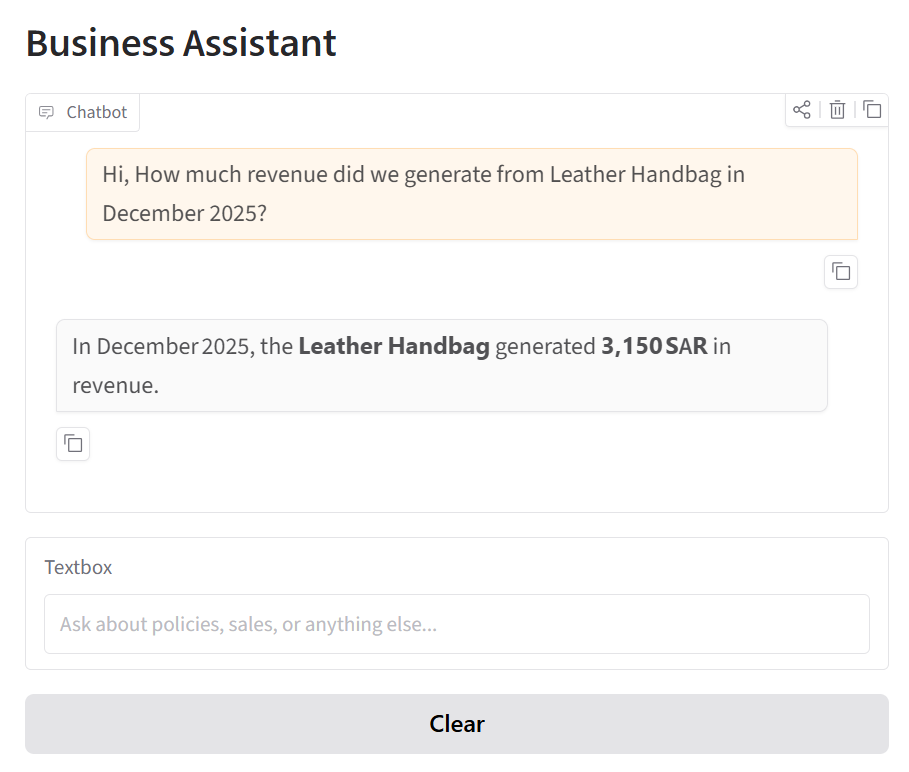
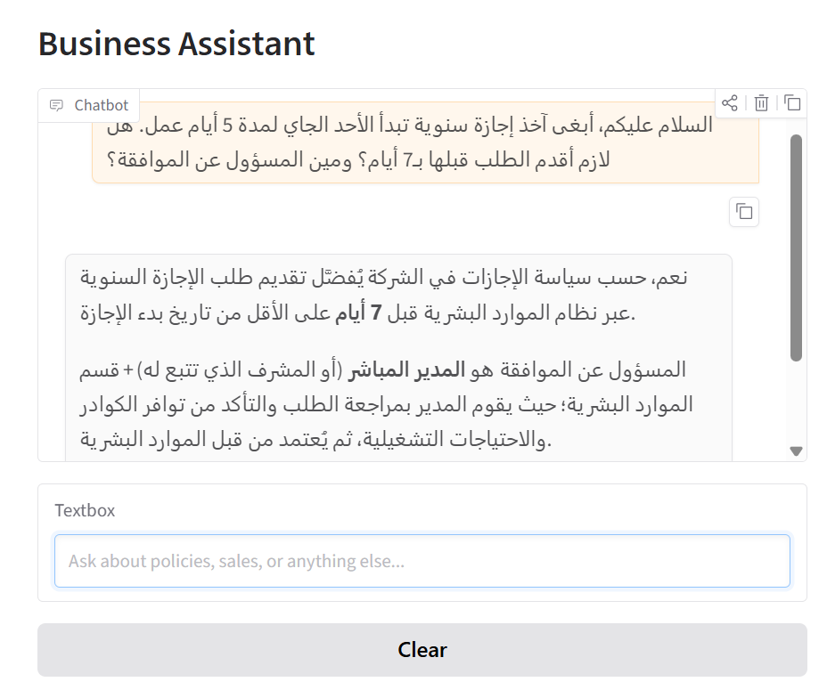
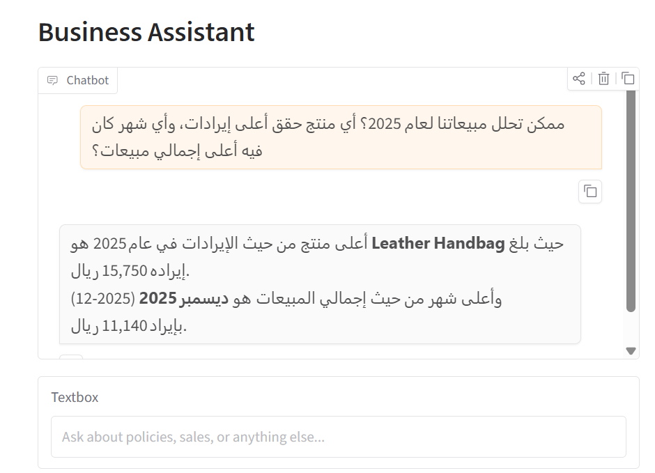

# 💬 Business Assistant

A conversational AI agent (Arabic + English) built for small retail/service businesses.
It answers three kinds of questions through a single chat interface:
policy/FAQ questions from your documents (RAG), sales and performance questions from
your data (pandas analysis), and it remembers context across the conversation (SQLite).


## Tech Stack

| Purpose | Tool |
|---|---|
| LLM inference | [Groq API](https://console.groq.com) |
| Agent orchestration / tool-calling | LangChain |
| Vector database (RAG) | ChromaDB |
| Embeddings | Hugging Face `sentence-transformers` (multilingual, for Arabic support) |
| Document parsing | `pypdf`, `python-docx`, `unstructured` |
| Sales data analysis | pandas |
| Conversation memory / preferences | SQLite |
| Chat interface | Gradio |


## Project Structure

```text
business-assistant/
├── config.py                    # All settings and paths in one place
├── app.py                       # Gradio UI entry point
├── requirements.txt
├── .env.example
│
├── data/
│   ├── documents/              # Policy/FAQ files (.txt/.pdf/.docx) → RAG source
│   ├── sales/
│   │   └── sample_sales.csv    # Sales data → pandas analysis source
│   ├── chroma_db/              # Generated: vector store after build_vector_db.py
│   └── memory.db               # Generated: conversation + preference history
│
├── scripts/
│   └── build_vector_db.py      # (Re)index documents into ChromaDB
│
└── src/
    ├── rag/
    │   ├── ingest.py           # Load docs → chunk → embed → store
    │   └── retriever.py        # Similarity search over stored chunks
    │
    ├── analysis/
    │   └── sales_functions.py  # Safe, predefined pandas queries
    │
    ├── memory/
    │   └── memory_store.py     # SQLite: conversation history + preferences
    │
    └── agent/
        ├── llm_client.py       # Groq API wrapper
        ├── router.py           # Tool schemas + dispatcher (routing logic)
        └── agent.py            # Orchestrates: history → LLM → tools → answer
```


## How It Works

1. A user message comes in through the Gradio chat.
2. The agent (`src/agent/agent.py`) sends it to Groq along with a list of available tools.
3. The LLM decides via function-calling, not keyword matching whether it needs to
   search documents, query sales data, both, or neither.
4. Chosen tool run, their results go back to the LLM, which composes the final answer.
5. The exchange is logged to SQLite so future turns have conversation context.

## Screenshots

### English Interface





### Arabic Interface

<div style="height: 400px; overflow: hidden;">
  
</div>

<div style="height: 400px; overflow: hidden;">
  
</div>


## How to Run

### 1. Clone or download the project

Open a terminal inside the `business-assistant` folder.

### 2. Create and activate a virtual environment

**Windows (PowerShell):**

```powershell
python -m venv venv
venv\Scripts\activate
```

**Mac/Linux:**

```bash
python3 -m venv venv
source venv/bin/activate
```

### 3. Install dependencies

```bash
pip install -r requirements.txt
```

### 4. Set up your API key

> **Note:** `.env` is intentionally not included in this repository because it contains a private API key. Create your own local `.env` file using the provided template.

**Create `.env` from the template:**

**Windows (PowerShell):**

```powershell
Copy-Item .env.example .env
```

**Mac/Linux:**

```bash
cp .env.example .env
```

Then open `.env` and add your Groq API key.

Get a free API key from [Groq Console](https://console.groq.com/).

```env
GROQ_API_KEY=your_actual_key_here
GROQ_MODEL=openai/gpt-oss-120b
```

### 5. Build the document index

Run this once to create the vector database. Run it again whenever you add or update files in `data/documents/`.

```bash
python scripts/build_vector_db.py
```

### 6. Launch the application

```bash
python app.py
```

Open the local URL printed in the terminal, usually:

```text
http://127.0.0.1:7860
```

Then open it in your browser.

